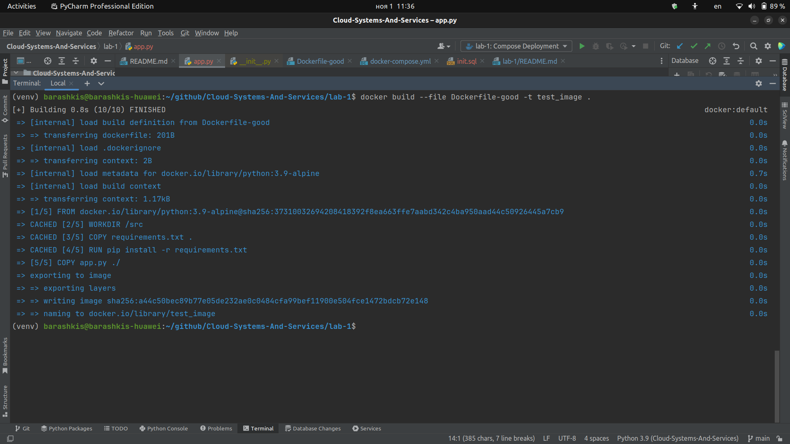

# Лабораторная работа №1

## Цель работы
Написать два Dockerfile – плохой (не менее трех ошибок) и хороший, а также привести две плохие практики по 
использованию образа (то есть создания контейнера).

## Задачи
1. Написать "плохой" Dockerfile, то есть тот, который был спроектирован неверно, но при этом корректно бы запускался
2. Написать "хороший" Dockerfile, в котором все ошибки будут исправлены
3. Описать все плохие практики, объяснить, почему они являются таковыми
4. Привести пример двух плохих практик по использованию этого контейнера
5. Написать docker-compose для автоматизации сборки проекта, использующего базу данных
6. Протестировать развертывание проекта с использованием docker и docker-compose

## Описание проекта, для которого были созданы Dockerfile'ы
Два Dockerfile предназначены для простого **Python-проекта** на Flask, запускающийся с одним флагом `--say-hello-to`, 
значение которого будет отображаться на результирующей странице. Данный проект использует сторонние 
библиотеки, и все файлы, имеющие отношение к проекту должны быть перенесены в контейнер.

## "Плохой" Dockerfile
Ниже приведены все ошибки в "плохом" Dockerfile, а также их описание (в разделе про "хороший" Dockerfile). 
Как выглядит этот Dockerfile:
```Dockerfile
FROM ubuntu:latest

RUN mkdir src &&
    cd src
WORKDIR /src

RUN apt-get update
RUN apt-get install -y python3

COPY app.py requirements.txt /src/
RUN pip install -r requirements.txt
```

### Размер итогового образа
Родительский образ (`FROM ubuntu:latest`) представляет собой полноценную операционную систему 
с большим количеством ненужных зависимостей, пакетов и так далее. Это же и относится к командам, выполненных с `apt-get`,
так как помимо Python в него.

### Выбор версии
Не следует указывать версию `latest` у родительского образа, так как она является "плавающей", и при выходе новой \
версии образа проект может "сломаться".

### Неотптизизированные операции
При изменении кода проекта и пересбоорке образа будет постоянно производиться 
установка сторонних библиотек из requirements.txt. Это происходит потому, что сборка образа начнется с первого слоя, 
хэш которого был изменен. При изменении кода в проекте сборка начнется с этапа `COPY app.py /src`, что означает, 
что `RUN pip install -r requirements.txt` будет выполняться всегда, а этого можно избежать.

### Лишние операции (слои, которых могло не быть)
Некоторые действия можно опустить, так как их автоматически выполняют другие операции. Так, здесь можно убрать `RUN mkdir src && cd src`.

### Отсутствие команды запуска проекта
Это значит, что ее обязательно нужно будет указывать в команде `docker run` после флага `-c`. Это может быть неудобно 
при запуске контейнера, а также привести к ошибкам (если, например, команда длинная или она была вовсе не введена).

## "Хороший" Dockerfile
Как выглядит этот Dockerfile:
```Dockerfile
FROM python:3.9-alpine

WORKDIR /src

COPY requirements.txt .
RUN pip install -r requirements.txt

COPY app.py .

ENTRYPOINT [ "python", "app.py" ]
CMD [ ]
```
Ниже приведен список изменений, исправляющие вышеупомянутые ошибки:
1. Был _изменен родительский образ_ (`FROM python:3.9-alpine`), который содержит все только все необходимое для сборки 
и запуска проекта
2. Версия родительского образа статическая, а не `latest`
3. Теперь файл с зависимостями копируется отдельно, чтобы, когда появятся изменения в них, 
только тогда они будут устанавливаться
4. _Убрана операция_ создания рабочей папки
5. _Добавление команды по умолчанию_ с помощью связки `ENTRYPOINT` и `CMD`.

### Плохие практики по использованию этого контейнера
- При запуске контейнера (без помощи `docker-compose`) важно указать флаг `-v`, чтобы иметь локальную копию данных, 
предназначенные для базы данных. Иначе при потере контейнера с БД все данные будут утеряны навсегда
- Использование команды `docker stop` вместо `docker kill` для остановки контейнера, который не отвечает - это
может привести к длительному ожиданию завершения процессов в контейнере и замедлению работы системы
- Использование команды `docker run` с флагом `--privileged` - это может дать контейнеру полный доступ к хост-системе 
и привести к потенциальным уязвимостям безопасности.

## Задание "под звездочкой"
Для выполнения этого задания был написан `docker-compose.yml`, в котором зказаны все опции запуска всех контейнеров, 
необходимых для корректного функционирования проекта. Вот как он выглядит:
```yml
version: "3.7"
services:
  app:
    container_name: test_app
    build:
      context: .
      dockerfile: Dockerfile-good
    environment:
      POSTGRES_DB: test_db
      POSTGRES_USER: test_user
      POSTGRES_PASSWORD: test_password
      POSTGRES_HOST: postgres
    ports:
      - "5000:5000"
    depends_on:
      - postgres
  postgres:
    container_name: postgres
    image: postgres:16
    volumes:
      - ./001.sql:/docker-entrypoint-initdb.d/001.sql
      - pg_data:/var/lib/postgresql/data
    environment:
      POSTGRES_DB: test_db
      POSTGRES_USER: test_user
      POSTGRES_PASSWORD: test_password
    ports:
      - "5432:5432"
volumes:
  pg_data:
```

### Краткий разбор docker-compose.yml
Здесь всего прописано 2 сервиса - это приложение и база данных, они представляют собой контейнеры (после запуска команды 
`docker-compose up`). В них прописаны все необходимые настройки:
1. Переменные среды для подключения к БД
2. Прокидывание портов
3. Образы, из которых будет собираться контейнер
4. Название контейнеров
5. Связывание файлов на машине и в контейнере с помощью `mount bind` и `volume` (контейнер с Postgres).

Пользовательское название Dockerfile'а задано с использованием поля `dockerfile` в сегменте `build`. Также стоить 
отметить, что контейнер с приложением запускается только после успешного старта контейнера с БД (ключ `depends_on`). 
В базе данных используются тома и монтирование файлов для обеспечения резервного копирования и инициирования таблиц.

## Тестирование
Здесь приведены скриншоты, подтверждающие работу написанных ранее файлов.

### Сборка образа из "хорошего" Dockerfile
Важно: код приложения на этом этапе не поддерживает взаимодействие с Postgres.



### Запуск контейнера из ранее созданного образа


### Запуск приложения с БД через docker-compose


### Проверка таблицы после отправки GET-запроса


## Вывод
В ходе данной работы мы написали два Dockerfile'а с достаточным количеством ошибок и соответствующим им исправлениям. 
Каждая ошибка была подробно описана и аргументирована, как и исправления к каждой из них. Помимо этого, мы привели 
три из большого количества плохих практик использования CLI docker.

В добавок к основной части работы было выполнено задание "под звездочкой": был написан `docker-compose.yml`, 
с помощью которого можно одной командой запустить все нужные контейнеры с нужными настройками.