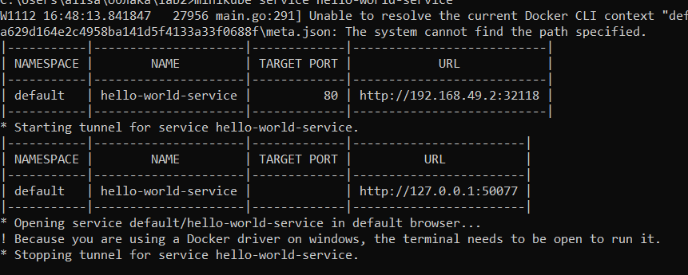
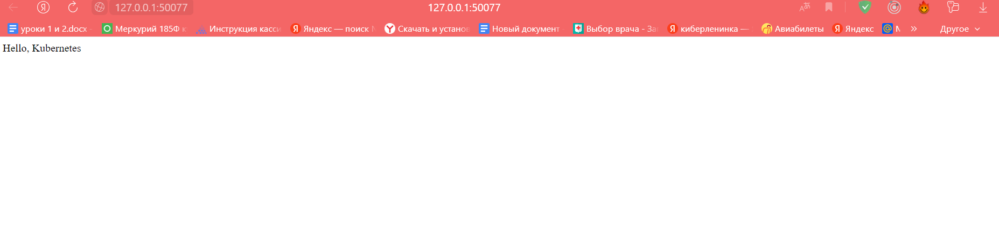

# Лабораторная работа №2

## Цель работы

Поднять kubernetes кластер локально, в нём развернуть свой сервис.

## Задачи

Использовать 2-3 ресурса kubernetes, поднять кластер minikube.

## Ход работы

Для поднятия локального Kubernetes кластера и развертывания своего сервиса были использованы Minikube и kubectl.

Образ Hello-world был загружен на Docker Hub. 
Код в файле deployment.yaml представляет конфигурацию Kubernetes Deployment, который определяет, как развертывать и управлять подами.

Deployment.yaml:

```yml
apiVersion: apps/v1
kind: Deployment
metadata:
  name: hello-world-deployment
spec:
  replicas: 2
  selector:
    matchLabels:
      app: hello-world
  template:
    metadata:
      labels:
        app: hello-world
    spec:
      containers:
        - name: hello-world-container
          image: alisaguliaeva/hello-world:latest
          ports:
            - containerPort: 80
```

1. apiVersion: Указывает на используемую версию API. В данном случае, это версия API для объектов типа Deployment в разделе apps.
2. kind: Определяет тип объекта конфигурации Kubernetes. В данном случае, это Deployment.
3. metadata: Содержит метаданные для Deployment, включая имя Deployment.
4. spec: Определяет желаемое состояние объекта. В данном случае, мы указываем параметры для Deployment.
5. replicas: Задает количество реплик (подов), которые должны быть созданы и поддерживаться Deployment. В этом примере у нас 2 реплики.
   selector: Определяет, какие поды должны быть выбраны для управления Deployment.
6. matchLabels: Определяет, что поды, управляемые Deployment, должны иметь метку (label) с именем "app" и значением "hello-world".
7. template: Определяет шаблон для создания подов, управляемых Deployment.
8. containers: Определяет контейнеры, которые должны быть запущены в поде.

Таким образом, этот файл deployment.yaml описывает, что мы хотим развернуть две реплики нашего сервиса "Hello World", каждая из которых будет состоять из контейнера, использующего образ alisaguliaeva/hello-world:latest

Сервис в Kubernetes предоставляет стабильный IP-адрес и DNS-имя для доступа к одному или нескольким подам.

Service.yaml:

```yml
apiVersion: v1
kind: Service
metadata:
  name: hello-world-service
spec:
  selector:
    app: hello-world
  ports:
    - protocol: TCP
      port: 80
      targetPort: 80
  type: NodePort
```

1. selector: Определяет, какие поды должны быть обслуживаемыми этим сервисом. В данном случае, сервис обслуживает поды с меткой "app: hello-world".
2. ports: Определяет порты, которые будут открыты на сервисе.
3. protocol: Протокол для этого порта (в данном случае, TCP).
4. port: Порт, который будет открыт на сервисе.
5. targetPort: Порт, на котором работает под, который обслуживается этим сервисом.
6. type: Определяет тип сервиса. В данном случае, это NodePort, что означает, что сервис будет доступен на каждом узле кластера на фиксированном порту.

```bash
kubectl apply -f deployment.yaml
kubectl apply -f service.yaml
```

С помощью следующей команды был получен внешний IP и порт сервиса:

```bash
minikube service hello-world-service
```



Для проверки работы в браузере был открыт данный сайт:


## Вывод

В результате работы был создан локальный Kubernetes кластер, развернут сервис и получен URL для доступа к сервису.
