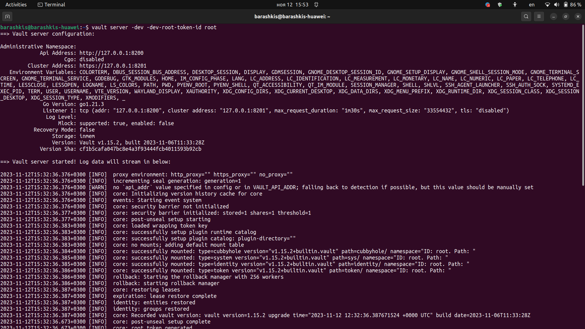
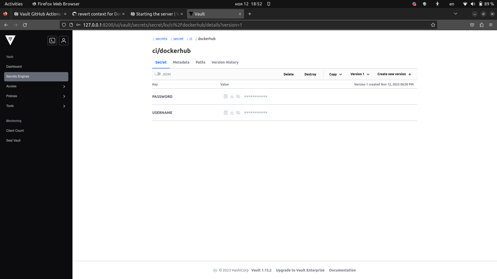
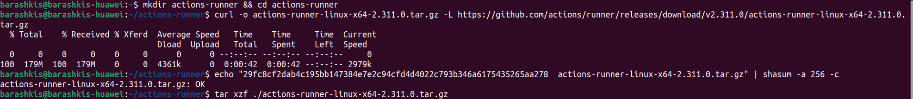
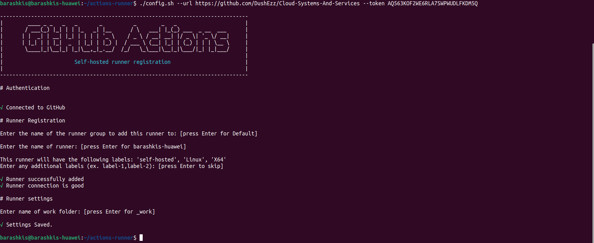
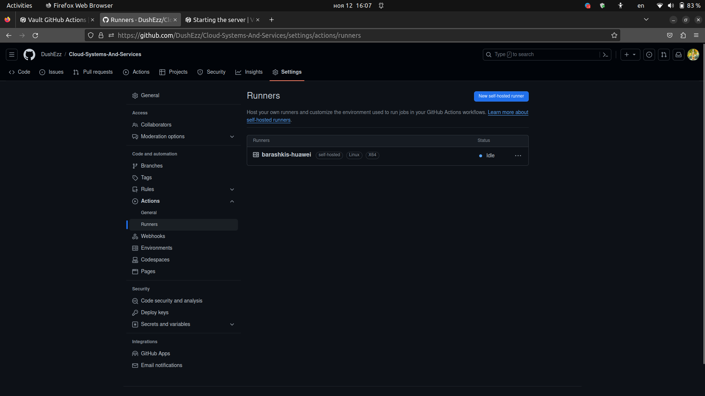
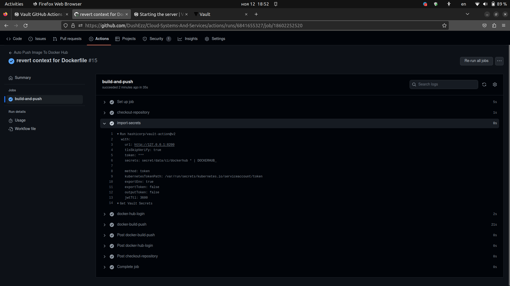

# Лабораторная работа №3

## Цель работы
Сделать, чтобы после push'а в папку `lab-3` ветки `main` репозитория автоматически собирался docker образ, который 
должен быть сохранен в Docker Hub.

## Задачи
1. Освоить технологию, обеспечивающую возможность выполнения такого рода задач
2. Обеспечить безопасность CI/CD процессов, а именно - закрытость чувствительных данных 
(данные для входа в аккаунт) Docker Hub 
3. Подключить Hashicorp Vault для более безопасного хранения секретов
4. Протестировать итоговое решение на корректность его работы


## Проект, использующийся для выполнения лабораторной работы
Используется урезанная версия проекта для первой лабораторной работы (без использования базы данных и переменных среды).

## Настройка CI/CD
Итак, для выполнения данной работы в GitHub необходимо воспользоваться его функционалом под названием Actions. С его 
помощью можно настроить CI/CD без использования специально предназначенного для этого сервера по типу CircleCI или
Jenkins. Тут нам необходимо создать `.yml` файл в директории `/.github/workflows` с произвольным названием \
(в данном случае это `lab-3.yml`). Вот так выглядит его содержимое:
```yml
name: Auto Push Image To Docker Hub

on:
  push:
    branches: "main"
    paths:
      - "lab-3/**"
      - ".github/workflows/**"

jobs:
  build-and-push:
    runs-on: ubuntu-22.04

    defaults:
      run:
        working-directory: "/lab-3"

    steps:
      - name: checkout-repository
        uses: actions/checkout@v4

      - name: docker-hub-login
        uses: docker/login-action@v3
        with:
          username: ${{ secrets.DOCKERHUB_USERNAME }}
          password: ${{ secrets.DOCKERHUB_PASSWORD }}

      - name: docker-build-push
        uses: docker/build-push-action@v5
        with:
          context: "./lab-3"
          push: true
          tags: dushez/dummy-flask-app-itmo:latest
```

### Разбор lab-3.yml
1. `name` означает название сценария, которое будет отображаться в секции Actions.
2. В `on` располагаются основные правила условия запуска сценария (триггеры, целевые ветки и так далее):
- Автозапуск после push в ветку `main`
- Сценарий надо запускать только если изменились файлы в директории 
третьей лабораторной работы или директории с настройками workflow
```yml
name: Auto Push Image To Docker Hub

on:
  push:
    branches: "main"
    paths:
      - "lab-3/**"
      - ".github/workflows/**"
```
3. С помощью ключевого слова `jobs` добавляется задача, имеющая свои ключи. Так, наша "джоба" будет запускаться в 
"раннере" с Linux Ubuntu 22.04. Также укажем директорию по умолчанию для всей задачи с помощью `working-directory`
```yml
jobs:
  build-and-push:
    runs-on: ubuntu-22.04

    defaults:
      run:
        working-directory: "/lab-3"
```

4. В секции `steps` последовательно описываются шаги выполнения задачи. У каждого шага есть свое имя, уже готовый 
сценарий и параметры, которые необходимо передать в сценарий для его успешного завершения. В данном случае у задачи всего три шага:
- Предоставить доступ так называемому "раннеру" к репозиторию (обязательный шаг)
```yml
- name: checkout-repository
  uses: actions/checkout@v4
```
- Войти в Docker Hub с использованием credentials, прописанных в GitHub Secrets (здесь используется логин и пароль, но 
также можно использовать токен доступа Docker Hub)
```yml
- name: docker-hub-login
  uses: docker/login-action@v3
  with:
    username: ${{ secrets.DOCKERHUB_USERNAME }}
    password: ${{ secrets.DOCKERHUB_PASSWORD }}
```
- Собрать образ, указав правильный контекст и запушить его в Docker Hub под нужным тегом
```yml
- name: docker-build-push
  uses: docker/build-push-action@v5
  with:
    context: "./lab-3"
    push: true
    tags: dushez/dummy-flask-app-itmo:latest
```

### Тестирование
Итак, после того, как все файлы готовы, их можно пушить на GitHub. И сразу после появления файла workflow на удаленном 
репозитории запустится первый описанный выше процесс. Все скриншоты, сделанные во время тестирования и хода работы 
приведены в Приложении 1.

## Приложение #1
Здесь приведены скриншоты, показывающие работу написанного ранее файла, а также иллюстрирующие 
дополнительные действия, сделанные для корректной работы процесса CI/CD.

### Создание нужных переменных в GitHub Secrets для дальнейшей авторизации в Docker Hub


### Запуск прописанного ранее Job


### Проверка наличия образа на Docker Hub


### Подключение Hashicorp Vault
Чтобы подключить данный сервер, необходимо модифицировать наш `.yml`. Ниже приведен его итоговый вид:
```yml
name: Auto Push Image To Docker Hub

on:
  push:
    branches: [ "main" ]
    paths:
      - "lab-3/**"
      - ".github/workflows/**"

jobs:
  build-and-push:
    runs-on: self-hosted

    defaults:
      run:
        working-directory: "/lab-3"

    steps:
      - name: checkout-repository
        uses: actions/checkout@v4

      - name: import-secrets
        uses: hashicorp/vault-action@v2
        with:
          url: http://127.0.0.1:8200
          tlsSkipVerify: true
          token: ${{ secrets.VAULT_TOKEN }}
          secrets: |
            secret/data/ci/dockerhub * | DOCKERHUB_

      - name: docker-hub-login
        uses: docker/login-action@v3
        with:
          username: ${{ env.DOCKERHUB_USERNAME }}
          password: ${{ env.DOCKERHUB_PASSWORD }}

      - name: docker-build-push
        uses: docker/build-push-action@v5
        with:
          context: "./lab-3"
          push: true
          tags: dushez/dummy-flask-app-itmo:latest
```
1. Первое изменение - это новый тип "раннера" - `self-hosted`.

Это означает, что вся "джоба" будет запускаться 
на рабочей машине. Но, чтобы все она запускалась корректно, необходимо настроить ее на опрос Github Actions 
на наличие нужных событий. Во втором приложении приведены иллюстрации настройки и запуска self-hosted runner'а.

2. Второе изменение касается нового step'а:
```yml
- name: import-secrets
  uses: hashicorp/vault-action@v2
  with:
    url: http://127.0.0.1:8200
    tlsSkipVerify: true
    token: ${{ secrets.VAULT_TOKEN }}
    secrets: |
      secret/data/ci/dockerhub * | DOCKERHUB_
```
Здесь используется action от GitHub, импортирующий нужные секреты из сервера Vault. Он поднят в локальной сети,
в которой находится настроенный ранее "раннер" (в нашем случае, так как он может быть также поднят в Интернете).

- Под ключом `url` указывается URL-адрес этого сервера
- Сгенерированный токен для доступа к секретам указывается под ключом `token`
- В поле `secrets` указано, какие секреты должны быть сохранены в переменные среды "джобы". В данном случае мы берем 
все секреты по указанному пути сохраняются по следующему принципу: `DOCKERHUB_` + `<название секрета на сервере>`
(в итоге получаются `DOCKERHUB_USERNAME` и `DOCKERHUB_PASSWORD`)

3. Также для пропуска логина и пароля в следующий "степ" теперь используются переменные из пространства имен `env`, 
а не `secrets`.

## Приложение #2
Здесь приведены скриншоты, показывающие работу написанного ранее файла, а также иллюстрирующие 
дополнительные действия, сделанные для корректной работы процесса CI/CD.

### Запуск Vault на рабочей машине


### Проверка созданных секретов


### Подготовка Self Hosted Runner на рабочей машине




### Проверка cоздания Sekf Hosted Runner на GutHub


### Проверка импорта секретов во времы выполнения Job



## Вывод
В ходе данной работы был настроен CI/CD workflow для автоматической сборки и публикации docker образа при выполнении 
push'а в конкретную директорию конкретной ветки. Мы протестировали валидность написанного файла конфигурации Job,
отвечающей как раз за выполнение описанных выше действий. Таким образом, цель работы была успешно достигнута.