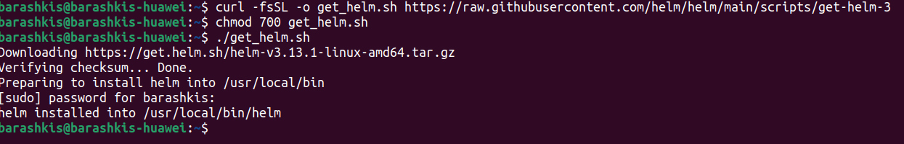
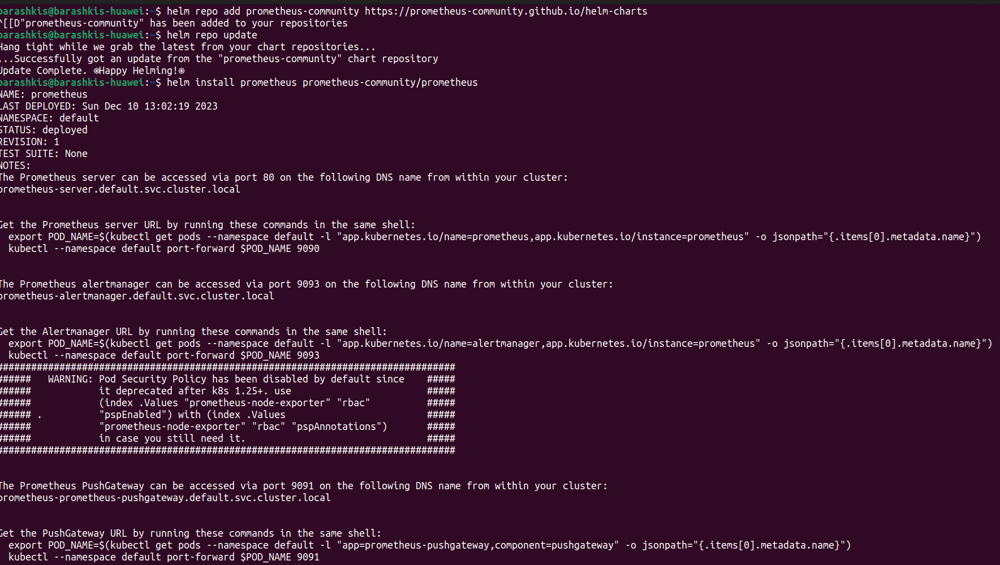
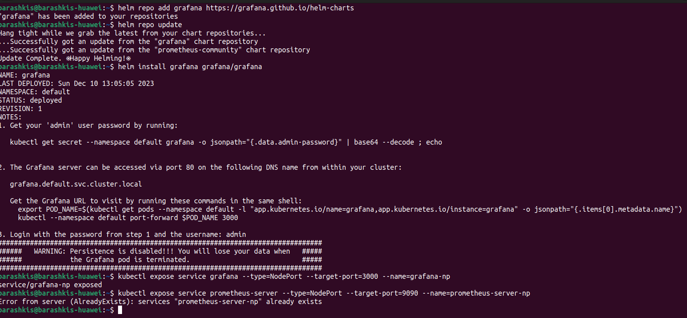
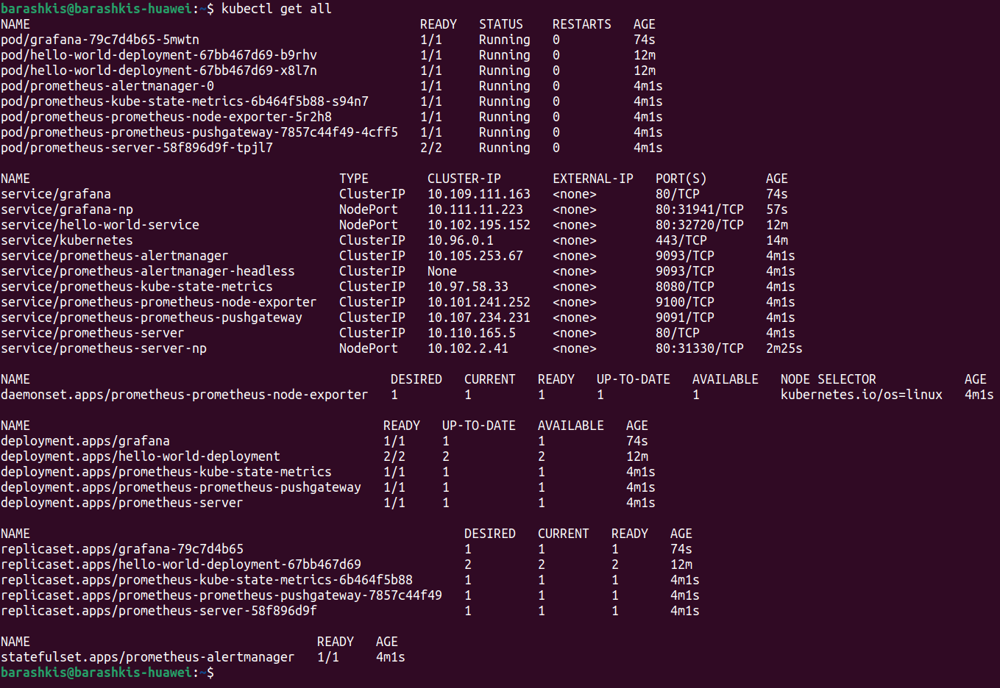
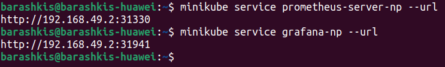
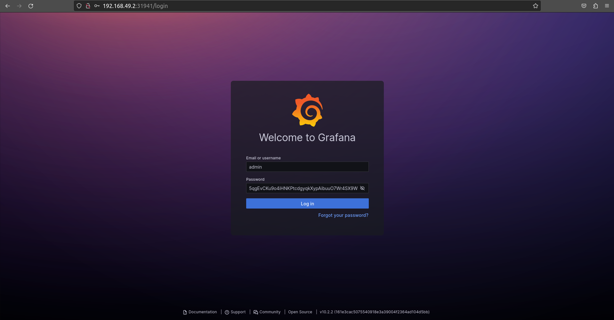
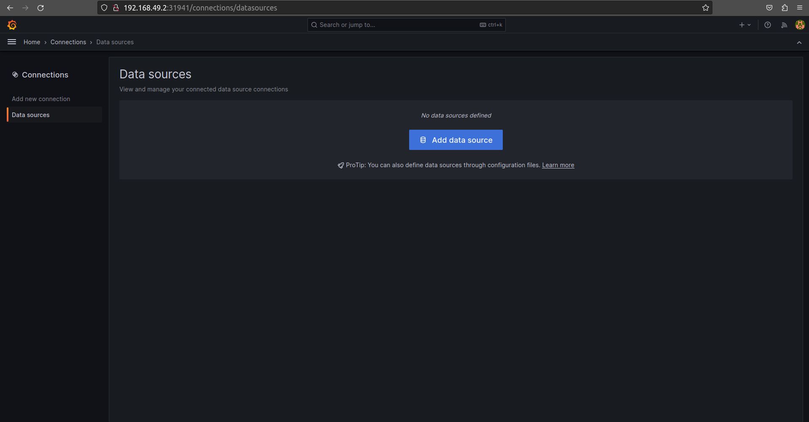
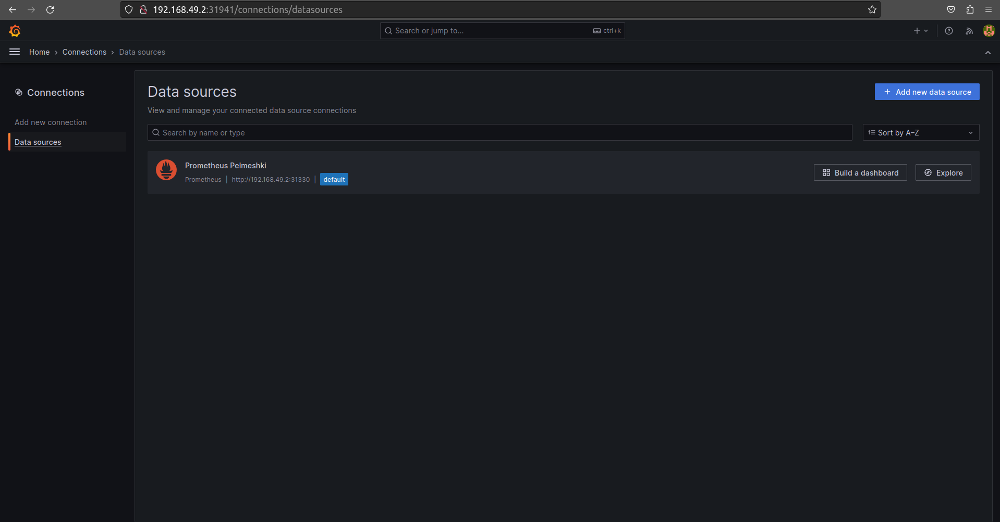
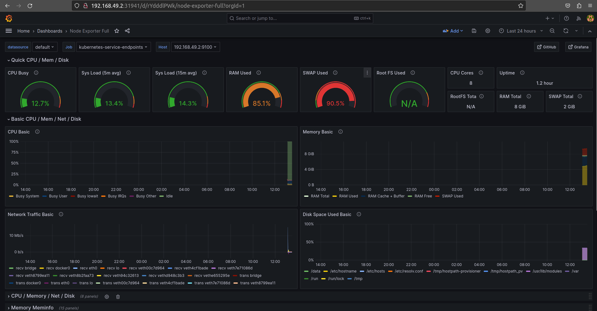

## Лабораторная работа №4
# Цель работы
Сделать мониторинг сервиса, поднятого в kubernetes.
# Задачи
Показать рабочие графики, которые будут отражать состояние системы.

# Ход работы
Установили helm для дальнейшей работы с Kubernetes.



Далее установили Prometheus и Grafana: \
Добавили удаленный репозиторий, устанавили Helm-чарты, чтобы развернуть мониторинг в кластере Kubernetes, указали порты для доступа к службам.

 \


Вывели информацию о всех ресурсах для проверки работоспособнисти сервисов.



Получили URL-адреса для Prometheus и Grafana, перейдя по которым мы попали на страницы соответствующих сервисов.



Авторизовались в Grafana под логином admin и паролем, который получили с помощью команды ```kubectl get secret --namespace default grafana -o jsonpath="{.data.admin-password}" | base64 --decode ; echo```



Далее мы указали источник метрик - Prometheus, чтобы модно было получить графики.




Перешли во вкладку Dashboards, чтобы импортировать новый dashboard. Мы выбрали шаблон Node exporter, который собирает метрики операционной системы. \
Получили следующие графики метрик.



# Вывод
В ходе выполнения лабораторной работы был проведен мониторинг сервиса, поднятого в kubernetes, показаны рабочие графики, отражающие состояние системы.
